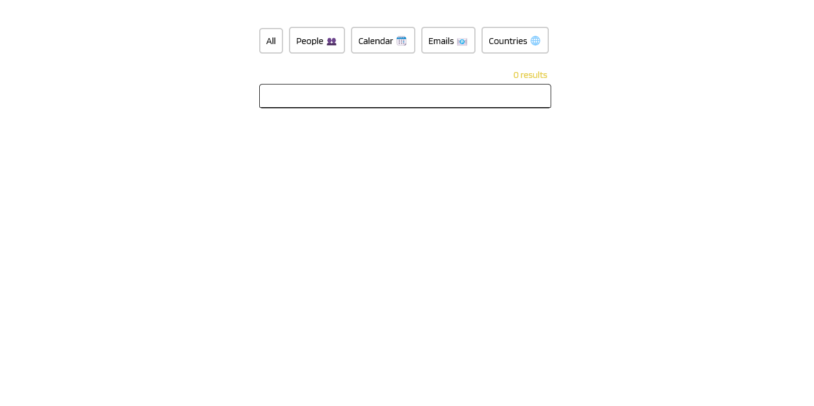

# BarraBusqueda-useMemo-React
A search bar was made that contains several categories where you can search for different data, a match of what the user typed using the keyboard is shown and shows the possible matches and the number of results obtained. React hooks such as useEffect and useMemo are used.

### Screenshot

### Links

- Solution URL: https://github.com/lizSilva27/BarraBusqueda-useMemo-React
- Live Site URL: https://searchbar-react.netlify.app

## Author

- GitHub - https://github.com/lizSilva27
- Frontend Mentor - https://www.frontendmentor.io/profile/lizSilva27
